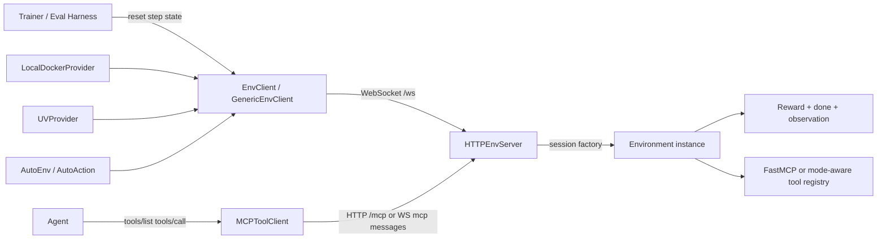
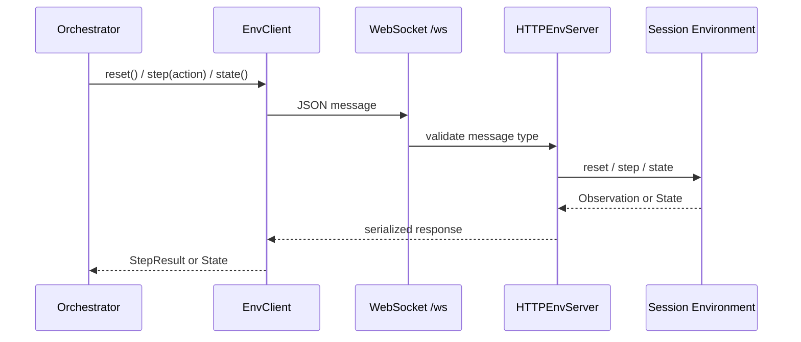
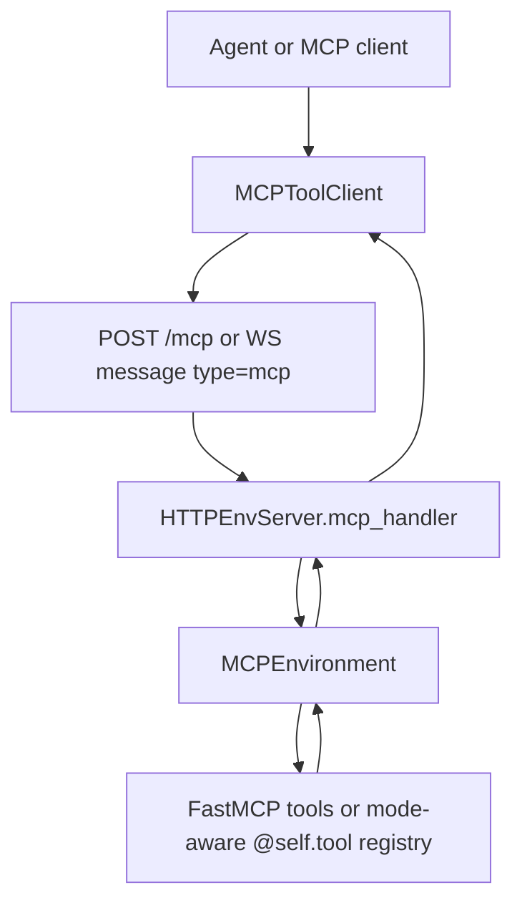
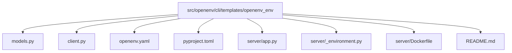
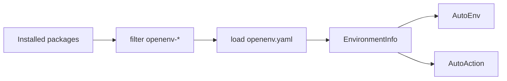
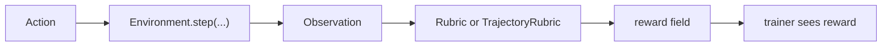
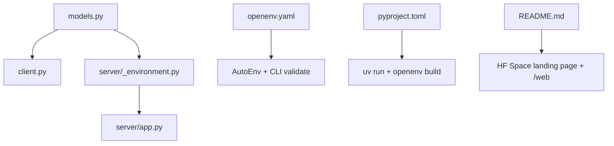

# OpenEnv Codebase Deep Dive

This document is a practical walkthrough of the current OpenEnv repository. It is organized around the actual implementation rather than the marketing surface: what the major components are, how they interact, where the important code lives, and how to add a new environment without violating the repo's design constraints.

## 1. Executive Summary

OpenEnv is a framework for building agentic execution environments with two distinct interaction surfaces:

| Surface | Audience | API shape | Why it exists |
| --- | --- | --- | --- |
| Simulation control | Trainer, evaluator, orchestration layer | Gym-like `reset()`, `step()`, `state()` over WebSocket/HTTP | Collect trajectories, compute rewards, manage episodes |
| Agent tool use | The agent running inside the task | MCP (`tools/list`, `tools/call`) | Let the agent act through tools without exposing simulation control |

That split is the central architectural idea in this repo.

At a high level:

| Area | Approx. size | Role |
| --- | --- | --- |
| `src/openenv/` | 58 files | Shared runtime, CLI, auto-discovery, evaluation and rubric support |
| `envs/` | 29 environment packages | Real and reference environments |
| `tests/` | 45 files | Core protocol, environment, CLI, and validation coverage |
| `docs/`, `examples/`, `tutorial/` | mixed | End-user docs and worked examples |
| `.claude/`, `.agents/` | mixed | Repo-specific agent workflows, review hooks, and engineering docs |

## 2. Architecture At A Glance



### Core mental model

1. An environment author implements a server-side `Environment` or `MCPEnvironment`.
2. `create_app(...)` wraps that implementation in a FastAPI app via `HTTPEnvServer`.
3. Clients talk to the server through WebSocket sessions, with one environment instance per active session.
4. Rewards are computed inside the environment boundary, optionally with server-side rubric/transform helpers.
5. The agent must not be able to call `reset()`, `step()`, or `state()` directly through MCP.

## 3. Repository Map

| Path | What it contains | Why it matters |
| --- | --- | --- |
| `README.md` | Project-level overview, quick start, architecture summary | Good first read for external framing |
| `src/openenv/core/` | Runtime primitives: server, client, containers, MCP, rubrics, evals | The real heart of the system |
| `src/openenv/cli/` | `openenv` scaffolding, validation, build and deployment commands | How environments are created and shipped |
| `src/openenv/auto/` | Discovery and factory APIs (`AutoEnv`, `AutoAction`) | Lets users load environments by name or Hub repo |
| `src/openenv_core/` | Compatibility shim | Supports legacy import paths |
| `envs/*` | Concrete environments | Best place to learn patterns by example |
| `tests/core/` | Protocol, MCP, rubric, eval, runtime tests | Defines the platform contract |
| `tests/envs/` | Environment integration and discovery tests | Shows how new envs should be validated |
| `tests/test_cli/` | CLI behavior and scaffolding tests | Shows what `init`, `build`, `push`, `validate` guarantee |
| `.claude/docs/` | Design principles, invariants, patterns, testing strategy | The repo's implementation contract |

## 4. Deep Dive By Component

### 4.1 Public package surface and compatibility

Relevant code:

| File | Responsibility |
| --- | --- |
| `src/openenv/__init__.py` | Unified public package exposing `core`, `cli`, `AutoEnv`, `AutoAction` |
| `src/openenv/core/__init__.py` | Lazy export layer for runtime primitives |
| `src/openenv_core/__init__.py` | Deprecated compatibility alias for `openenv.core` |

Design notes:

| Choice | Implementation | Effect |
| --- | --- | --- |
| Lazy imports | `__getattr__` in `src/openenv/__init__.py` and `src/openenv/core/__init__.py` | Keeps import cost down and avoids loading heavy submodules up front |
| Compatibility shim | `src/openenv_core/__init__.py` | Preserves older user code while steering callers to `openenv.core` |
| Unified packaging | root `pyproject.toml` exposes `openenv` CLI and runtime extras | One repo can ship both framework code and tooling |

### 4.2 Core type system and server contract

Relevant code:

| File | Responsibility |
| --- | --- |
| `src/openenv/core/env_server/types.py` | Pydantic wire models for actions, observations, state, health, schemas, WebSocket messages |
| `src/openenv/core/env_server/interfaces.py` | `Environment` base class, transform hooks, rubric hooks, concurrency flag |
| `src/openenv/core/env_server/serialization.py` | Convert JSON payloads into typed actions and typed observations back into wire format |
| `src/openenv/core/env_server/http_server.py` | Route registration, session management, HTTP + WebSocket + MCP serving |
| `src/openenv/core/env_server/route_config.py` | Small helper for declarative GET endpoint registration |

#### The server-side contract

Every environment ultimately conforms to this contract:

| Concept | Base type | Required implementation |
| --- | --- | --- |
| Action | `Action` | Define the inputs the environment accepts |
| Observation | `Observation` | Define the outputs returned after reset/step |
| State | `State` | Track episode metadata and any custom internal state that should be inspectable |
| Environment | `Environment[ActT, ObsT, StateT]` | Implement `reset`, `step`, and `state` |

Important design choices from the implementation:

| Rule | Where enforced | Why |
| --- | --- | --- |
| Wire types are Pydantic models | `types.py`, invariants doc | Stable validation and JSON schema generation |
| Reward lives inside the environment boundary | `interfaces.py`, design docs | Domain knowledge stays with the environment |
| Session concurrency is opt-in | `SUPPORTS_CONCURRENT_SESSIONS` in `interfaces.py`, validated in `HTTPEnvServer` | Prevents accidental unsafe parallelism |
| App factory must be callable, not an instance | `HTTPEnvServer.__init__` | One WebSocket session must map to one environment instance |

#### Request/response flow for the simulation loop



Implementation details worth knowing:

| Behavior | Code path | Consequence |
| --- | --- | --- |
| One WebSocket session creates one dedicated environment instance | `_create_session()` in `http_server.py` | Episode state is isolated per client |
| Sync environments run in thread pools | `_run_sync_in_thread_pool()` and `_run_in_session_executor()` | Async server can host sync libraries like Playwright |
| HTTP endpoints are still available | `/reset`, `/step`, `/state`, `/schema`, `/metadata`, `/health` | Useful for validation and tooling, but WebSocket is the real episode loop |
| Web interface is optional | `create_app()` checks `ENABLE_WEB_INTERFACE` | The same server can ship a playground UI at `/web` |

### 4.3 Client stack

Relevant code:

| File | Responsibility |
| --- | --- |
| `src/openenv/core/env_client.py` | Async-first base client using persistent WebSockets |
| `src/openenv/core/sync_client.py` | Sync wrapper around `EnvClient` using a background event loop |
| `src/openenv/core/generic_client.py` | Dictionary-based client that avoids environment-specific imports |
| `src/openenv/core/mcp_client.py` | MCP-specific clients for tool discovery and invocation |
| `src/openenv/core/client_types.py` | `StepResult` container |

#### Client flavors

| Client | When to use it | Tradeoff |
| --- | --- | --- |
| `EnvClient` subclass | You own the environment package and want strong typing | Best ergonomics, requires custom parser code |
| `SyncEnvClient` | You need sync code on top of the async runtime | Easier integration, but still wraps async underneath |
| `GenericEnvClient` | You want to connect without importing environment-specific code | No strong typing, but safer and lighter-weight |
| `MCPToolClient` | The environment is MCP-first or production-facing | Tool-centric API, not a generic simulation client |

#### Why the client is async-first

The implementation in `env_client.py` assumes long-lived, low-latency sessions. That makes `async with` the natural API and explains why `SyncEnvClient` exists as a wrapper rather than the other way around.

Practical implication: when creating new environments, write the client with async semantics first and expose sync usage through `.sync()` when needed.

### 4.4 Dual API boundary: simulation vs MCP

Relevant code:

| File | Responsibility |
| --- | --- |
| `src/openenv/core/env_server/mcp_environment.py` | `MCPEnvironment` base class, list/call routing, mode-aware tools |
| `src/openenv/core/env_server/mcp_types.py` | MCP action/observation models and JSON-RPC types |
| `src/openenv/core/mcp_client.py` | Client-side tool discovery and invocation |
| `tests/core/test_production_mode_routes.py` | Verifies simulation-control routes are hidden in production mode |
| `tests/core/test_simulation_mode_preserves_api.py` | Verifies simulation mode keeps the full API surface |
| `tests/core/test_mcp/test_mode_aware_tools.py` | Verifies per-mode tool registration |

#### The boundary in one table

| Dimension | Simulation mode | Production mode |
| --- | --- | --- |
| Intended caller | Trainer / evaluator | Agent / production runtime |
| Main protocol | Gym-like reset-step-state | MCP JSON-RPC |
| Simulation control endpoints | Present | Hidden from HTTP surface |
| Rewards | Present in step responses | Typically bypassed for direct tool use |
| `/mcp` | Available | Available |
| `/ws` | Available | Still available, but safe use is MCP messages |

#### MCP flow



Key implementation details:

| Feature | How it works | Why it matters |
| --- | --- | --- |
| Reserved tool names | `reset`, `step`, `state`, `close` are blocked in `mcp_environment.py` | Protects the simulation-control boundary |
| No reset required for tool discovery | `ListToolsAction` can run immediately | Production agents can inspect tools without episode choreography |
| Mode-aware tools | `@self.tool(mode="production" | "simulation")` | Same logical tool name can map to real vs mocked behavior |
| Fallback hybrid behavior | `MCPEnvironment.step()` routes MCP actions itself and delegates everything else to `_step_impl()` | Lets environments combine tool APIs with custom simulation logic |

### 4.5 Runtime providers and execution backends

Relevant code:

| File | Responsibility |
| --- | --- |
| `src/openenv/core/containers/runtime/providers.py` | `ContainerProvider`, `LocalDockerProvider`, Swarm support |
| `src/openenv/core/containers/runtime/uv_provider.py` | Runs an ASGI app through `uv run` for local dev |
| `src/openenv/core/containers/runtime/daytona_provider.py` | Cloud sandbox execution via Daytona |
| `src/openenv/core/containers/images/Dockerfile` | Shared base image |

#### Backend choices

| Backend | Best for | Notes |
| --- | --- | --- |
| `LocalDockerProvider` | Reproducible local builds and containerized testing | Default for `from_docker_image()` and `from_env(..., use_docker=True)` |
| `UVProvider` | Local development from source without building an image | Good inner loop for environment authors |
| `DaytonaProvider` | Remote sandbox execution | More cloud-oriented, less central to the local author workflow |

The runtime providers are intentionally thin: they start a process or container, wait for `/health`, and hand back a base URL. The protocol layer remains the same regardless of backend.

### 4.6 CLI and packaging workflow

Relevant code:

| File | Responsibility |
| --- | --- |
| `src/openenv/cli/__main__.py` | CLI entry point and command registration |
| `src/openenv/cli/commands/init.py` | Environment scaffolding |
| `src/openenv/cli/commands/build.py` | Smart Docker build flow for in-repo vs standalone envs |
| `src/openenv/cli/commands/validate.py` | Local and runtime validation |
| `src/openenv/cli/commands/push.py` | Hugging Face Space staging and upload |
| `src/openenv/cli/commands/fork.py` | Duplicate a Space to your own namespace |
| `src/openenv/cli/commands/serve.py` | Placeholder command; not implemented yet |
| `src/openenv/cli/templates/openenv_env/` | The canonical environment scaffold |

#### CLI command map

| Command | What it does today | Design significance |
| --- | --- | --- |
| `openenv init` | Generates a new environment package from templates | Canonical starting point for authors |
| `openenv build` | Builds a Docker image with repo-aware context handling | Keeps in-repo and standalone builds aligned |
| `openenv validate` | Validates local structure or a running server | Encodes the deployment contract |
| `openenv push` | Prepares and uploads a Hugging Face Docker Space | Main publishing flow |
| `openenv fork` | Duplicates a Space | Encourages derivation and contribution |
| `openenv serve` | Not implemented; points users to `uv run` or Docker | The repo is still converging on a local serve UX |

#### What `init` actually scaffolds



Important implementation detail: `init.py` performs placeholder replacement across file contents and filenames, then tries to generate a `uv.lock`. That means the scaffold is intended to be runnable immediately after dependency setup.

### 4.7 Auto-discovery and factory loading

Relevant code:

| File | Responsibility |
| --- | --- |
| `src/openenv/auto/_discovery.py` | Installed package discovery, manifest loading, caching |
| `src/openenv/auto/auto_env.py` | Load environment clients by name or Hub repo |
| `src/openenv/auto/auto_action.py` | Load action classes by name or Hub repo |

#### Discovery flow



Design notes:

| Behavior | Why it exists |
| --- | --- |
| Flexible name normalization (`echo`, `echo-env`, `echo_env`) | Reduces friction for users |
| Package metadata + manifest loading | Keeps discovery decoupled from repo layout |
| Optional Hub install path in `AutoEnv` | Lets users boot environments from Hugging Face repos |
| `skip_install=True` in `AutoAction` | Supports generic clients without importing remote code |

### 4.8 Environment catalog patterns

The `envs/` directory is not a single pattern repeated 29 times. It contains several styles of environment:

| Style | Base class | Client style | Representative example |
| --- | --- | --- | --- |
| Typed step environment | `Environment` | Typed `EnvClient` subclass | `envs/coding_env/` |
| MCP-first tool environment | `MCPEnvironment` | `MCPToolClient` | `envs/echo_env/` |
| Rich domain envs | mixed | typed or MCP-based | `coding_env`, `browsergym_env`, `carla_env`, `openapp_env` |

#### Reference implementation 1: `envs/echo_env`

Why it matters:

| Aspect | Implementation |
| --- | --- |
| Server base | `envs/echo_env/server/echo_environment.py` subclasses `MCPEnvironment` |
| Tool definitions | Inline `FastMCP` server inside the environment constructor |
| Client | `envs/echo_env/client.py` subclasses `MCPToolClient` |
| Package exports | `envs/echo_env/__init__.py` re-exports `EchoEnv`, `CallToolAction`, `ListToolsAction` |

What it demonstrates well:

1. Minimal MCP-first environment wiring.
2. Tool discovery and tool invocation through the OpenEnv boundary.
3. A clean example of the agent-facing API without simulation-control leakage.

#### Reference implementation 2: `envs/coding_env`

Why it matters:

| Aspect | Implementation |
| --- | --- |
| Wire models | `envs/coding_env/models.py` defines typed action, observation, and state |
| Environment logic | `envs/coding_env/server/python_codeact_env.py` is the richer task implementation |
| App wiring | `envs/coding_env/server/app.py` passes the class, not an instance, to `create_app` |
| Client parsing | `envs/coding_env/client.py` translates wire payloads into typed results |

What it demonstrates well:

1. Classic action/observation/state modeling.
2. Server-owned reward and episode logic.
3. The intended class/factory pattern for per-session environments.

#### Important repo nuance

The scaffold under `src/openenv/cli/templates/openenv_env/` is still typed-step-first, while some newer reference environments such as `echo_env` are MCP-first. When creating a new environment, decide which interaction model you want up front; both are supported, but they lead to different client and model shapes.

Also note the distinction between "good conceptual reference" and "good scaffold reference":

| Environment | Best used as | Why |
| --- | --- | --- |
| `echo_env` | MCP design reference | Cleanest small example of `MCPEnvironment` and `MCPToolClient`, but it is not the best validator-clean scaffold example |
| `coding_env` | Modern typed/scaffold reference | Better matches the current class/factory and typed-client authoring path |
| Older envs like `connect4_env` | Domain logic examples | Useful, but not always the cleanest source for the latest packaging/validation expectations |

#### Case study: `envs/tbench2_env`

`tbench2_env` is a very good example of a typed environment whose "world" is partly implemented in code and partly delegated to an external task bundle.

Core pieces:

| Component | Where it lives | What it does |
| --- | --- | --- |
| Action schema | `envs/tbench2_env/models.py` | Defines the allowed external verbs: `exec`, `write`, `view`, `wait`, `kill`, `write_file`, `evaluate`, `close` |
| Client | `envs/tbench2_env/client.py` | Turns `Tbench2Action` objects into wire payloads and parses observations/state |
| App wiring | `envs/tbench2_env/server/app.py` | Chooses local vs Docker execution mode, then exposes the env with `create_app(...)` |
| Local backend | `envs/tbench2_env/server/tbench2_env_environment.py` | Uses CAMEL `TerminalToolkit` to execute commands in the task directory |
| Docker backend | same file (`Tbench2DockerEnvironment`) | Starts a task container, copies files in, executes commands in-container |
| External task assets | Terminal-Bench 2 task directory (`instruction.md`, `task.toml`, `tests/`) | Supply the task prompt, task runtime metadata, and the verifier tests |

The action path is hard-wired in environment code:

1. `reset(task_id=...)` resolves a task directory, reads `instruction.md`, initializes the backend, and stores the task state.
2. `step(action)` dispatches on `action.action_type`.
3. For `exec`, `write`, `view`, `wait`, and `kill`, the environment forwards the request to the terminal backend.
4. For `write_file`, it writes content into the task workspace.
5. For `evaluate`, it runs the task's tests and turns the test exit code into reward.

That means the interaction model is split cleanly:

| Controlled by the environment code | Controlled by the external agent/policy |
| --- | --- |
| Which action types exist | Which action type to choose next |
| How each action type is interpreted | What command/content/file path to send |
| How the task directory is located and initialized | How to sequence multiple actions toward task completion |
| How evaluation works (`pytest` -> reward 1.0/0.0) | Whether and when to call `evaluate` |
| Whether the backend is local or Docker | The actual shell/program logic executed inside the task |

So for Terminal-Bench 2, the environment is not "thinking" for the agent. The environment predefines the interface and execution semantics, while the external algorithm decides the actual behavior by choosing actions and their arguments.

### 4.9 Rubrics, transforms, and eval harnesses

Relevant code:

| File | Responsibility |
| --- | --- |
| `src/openenv/core/rubrics/base.py` | Base `Rubric` abstraction with hooks and child registration |
| `src/openenv/core/rubrics/containers.py` | Composition helpers like `Sequential`, `WeightedSum`, `Gate` |
| `src/openenv/core/rubrics/trajectory.py` | Delayed/trajectory-level reward logic |
| `src/openenv/core/rubrics/llm_judge.py` | LLM-as-a-judge reward computation |
| `src/openenv/core/env_server/base_transforms.py` | Observation transform composition |
| `src/openenv/core/evals/base.py` | Eval harness abstraction |
| `src/openenv/core/evals/inspect_harness.py` | Inspect AI integration |
| `src/openenv/core/llm_client.py` | Generic LLM RPC abstraction for judge-based scoring |

#### Reward layering model



The design intent is:

| Layer | Responsibility |
| --- | --- |
| Environment logic | Execute the domain action and own the episode state |
| Rubric | Compute or refine reward in a structured, reusable way |
| Transform | Post-process observations server-side |
| Eval harness | Score a trained model or policy outside the online step loop |

This is an important distinction: OpenEnv keeps reward logic inside the server boundary even when it is factored into helper abstractions.

### 4.10 Testing and validation surface

Relevant code and docs:

| Path | What it verifies |
| --- | --- |
| `tests/core/` | Protocol contracts, production/simulation mode behavior, rubric behavior, eval helpers |
| `tests/envs/` | Environment integration, discovery, websocket/server behavior |
| `tests/test_cli/` | `init`, `build`, `push`, `validate`, `fork` behavior |
| `.claude/docs/TESTING_STRATEGY.md` | Testing philosophy |
| `src/openenv/cli/_validation.py` | Runtime API validation rules |

#### Validation layers

| Layer | Tooling | Typical failure caught |
| --- | --- | --- |
| Structure validation | `validate_env_structure()` and `openenv validate <path>` | Missing `openenv.yaml`, `models.py`, Dockerfile, `server/app.py` |
| Deployment contract validation | `validate_multi_mode_deployment()` | Missing `uv.lock`, missing `main()`, missing `[project.scripts].server` |
| Runtime validation | `openenv validate http://...` | Broken `/health`, `/schema`, `/metadata`, `/mcp`, or mode contract |
| Protocol/integration tests | `tests/core`, `tests/envs` | Session bugs, MCP routing bugs, concurrency bugs |

## 5. How To Create A New Environment

This section is the practical authoring guide.

### 5.1 First choose the environment style

| Style | Pick it when | Required building blocks |
| --- | --- | --- |
| Typed step environment | The task is naturally framed as agent actions -> environment observations | `models.py`, custom `EnvClient`, `Environment`, `create_app` |
| MCP-first environment | The task is better modeled as tool use | `MCPEnvironment`, `MCPToolClient`, MCP tool definitions |
| Hybrid | You need both step semantics and MCP tools | `MCPEnvironment` plus custom `_step_impl()` |

If you are unsure, start with the typed scaffold from `openenv init`, then switch to `MCPEnvironment` only if the task is fundamentally tool-driven.

### 5.2 Key concepts you must preserve

| Concept | Why it matters | Where it shows up |
| --- | --- | --- |
| Client-server separation | Clients must not import server internals | Keep shared types in `models.py` |
| Rewards live in the environment | Prevents reward logic drifting into training code | `step()` and rubric helpers |
| Agents cannot reset | Protects causality and training semantics | Never expose reset/step/state as MCP tools |
| Factory-per-session server wiring | Preserves state isolation | `create_app(MyEnvironment, ...)`, not `create_app(MyEnvironment(), ...)` |
| Concurrency is opt-in | Shared mutable state is easy to get wrong | `SUPPORTS_CONCURRENT_SESSIONS` plus `max_concurrent_envs` |
| Pydantic wire models | Validation, schemas, tooling | `Action`, `Observation`, `State` subclasses |
| Manifest-driven packaging | Discovery and CLI expect it | `openenv.yaml`, `pyproject.toml`, `README.md` |

### 5.3 The canonical file layout

`openenv init my_env` generates this structure:

| File | Required | Purpose |
| --- | --- | --- |
| `__init__.py` | yes | Re-export the client and public types |
| `models.py` | yes | Shared wire types |
| `client.py` | yes for typed envs | Client-side serializer/parser |
| `openenv.yaml` | yes | Manifest used by tooling and discovery |
| `pyproject.toml` | yes | Dependencies and `server` script entry point |
| `README.md` | yes | User-facing docs and Hugging Face Space metadata |
| `server/<env>_environment.py` | yes | Server-side environment logic |
| `server/app.py` | yes | FastAPI app factory |
| `server/Dockerfile` | yes | Container build |
| `uv.lock` | strongly expected | Reproducible dependency lock for validation/build |

#### Relationship between those files



### 5.4 Step-by-step implementation playbook

#### Step 1: scaffold

```bash
openenv init my_env
```

If you are contributing inside this repo, move it under `envs/my_env/`.

#### Step 2: define the wire models

In `models.py`:

1. Subclass `Action` for the input the agent/trainer sends.
2. Subclass `Observation` for what the environment returns.
3. Optionally subclass `State` when you need more than `episode_id` and `step_count`.

Guidelines:

| Guideline | Reason |
| --- | --- |
| Use explicit fields and `Field(...)` descriptions | Better schema generation and docs |
| Put only wire-safe data in the models | Serialization must remain JSON-compatible |
| Keep `reward` and `done` on the observation contract | The rest of the stack expects them |

#### Step 3: implement the server environment

For typed environments, subclass `Environment`.

Checklist:

| Method/property | What it should do |
| --- | --- |
| `reset(seed=None, episode_id=None, **kwargs)` | Initialize a fresh episode and return the first observation |
| `step(action, timeout_s=None, **kwargs)` | Mutate internal state, compute reward, return next observation |
| `state` | Expose inspectable episode state |
| `close()` | Clean up any external resources if your env uses them |

If you are using rubrics:

| In `reset` | Call `_reset_rubric()` or `_reset_rubric_async()` |
| In `step` | Set `observation.reward = self._apply_rubric(...)` or async equivalent |

#### Step 4: implement the client

For typed environments, subclass `EnvClient[ActT, ObsT, StateT]`.

Your client is responsible for three things:

| Method | Job |
| --- | --- |
| `_step_payload(action)` | Convert the typed action into a JSON-ready dict |
| `_parse_result(payload)` | Convert the wire payload into a typed `StepResult` |
| `_parse_state(payload)` | Convert the state payload into the right state type |

If the environment is MCP-first, you usually do not need a custom parser-heavy client; subclass `MCPToolClient` like `envs/echo_env/client.py`.

#### Step 5: wire the app correctly

In `server/app.py`:

```python
from openenv.core.env_server import create_app

app = create_app(
    MyEnvironment,   # pass the class or a factory
    MyAction,
    MyObservation,
    env_name="my_env",
)
```

Do not pass an already-created environment instance unless you intentionally want to give up per-session isolation, and note that the current `HTTPEnvServer` constructor explicitly rejects non-callables.

#### Step 6: package it for tooling

`openenv.yaml` should at minimum contain:

| Field | Meaning |
| --- | --- |
| `spec_version` | Manifest schema version |
| `name` | Environment package name |
| `type` | Usually `space` |
| `runtime` | Usually `fastapi` |
| `app` | ASGI app path, typically `server.app:app` |
| `port` | Usually `8000` |

`pyproject.toml` should include:

| Requirement | Why |
| --- | --- |
| `openenv-core>=...` or `openenv>=...` | Runtime dependency |
| `[project.scripts].server = "...:main"` | `openenv validate` checks for it |
| Environment-specific dependencies | Build/runtime correctness |

`server/app.py` should also define a `main()` function and a `if __name__ == "__main__": main()` entry point. The validation command checks for both.

#### Step 7: choose whether it is concurrency-safe

Only set `SUPPORTS_CONCURRENT_SESSIONS = True` if:

1. Each session gets isolated state.
2. Shared resources are safe under parallel access.
3. You are comfortable running with `max_concurrent_envs > 1`.

If you are not sure, leave it off and keep the default single-session model.

### 5.5 Testing and validation checklist for a new environment

This is the minimum validation path that fits the current codebase.

| Goal | Command or method | What success means |
| --- | --- | --- |
| Validate local file structure | `openenv validate envs/my_env` | No missing manifest/script/lockfile issues |
| Run targeted tests | `PYTHONPATH=src:envs uv run pytest tests/envs/test_my_env.py -v` | Your environment behavior passes |
| Run general env integration tests if applicable | `PYTHONPATH=src:envs uv run pytest tests/envs/test_websockets.py -v -k my_env` | Server boot + protocol shape look correct |
| Serve locally from source | `uv run --project envs/my_env server --port 8000` | `/health` comes up |
| Validate runtime contract | `openenv validate http://127.0.0.1:8000` | `/health`, `/schema`, `/metadata`, `/mcp`, mode contract all pass |
| Build the image | `openenv build envs/my_env` | Docker build succeeds with the repo-aware context |

Recommended extra checks:

| Check | Why it is useful |
| --- | --- |
| `bash .claude/hooks/lint.sh` | Fast format/lint sanity check |
| `bash .claude/hooks/test.sh` | Broad repo test sweep |
| Manual WebSocket or MCP smoke test | Confirms the exact interaction style you designed |

### 5.6 What to test, specifically

#### Unit tests

| Target | Example assertion |
| --- | --- |
| Model validation | Invalid actions fail validation |
| Environment step logic | Rewards, terminal conditions, state updates are correct |
| State reset behavior | `step_count` and `episode_id` reset properly |
| Rubric behavior | Reward hooks produce the expected score |

#### Integration tests

| Target | Example assertion |
| --- | --- |
| `create_app(...)` wiring | The server boots and responds on `/health` |
| WebSocket reset/step/state | The episode loop works end to end |
| MCP tools | `tools/list` and `tools/call` work without leaking reserved controls |
| Concurrent sessions | Separate clients do not share state unexpectedly |

#### Deployment contract tests

| Target | Example assertion |
| --- | --- |
| `pyproject.toml` | Has `server` entry point and runtime dependency |
| `server/app.py` | Has `main()` and executable module entry |
| `README.md` | Has useful environment docs; if targeting Spaces, proper frontmatter |
| `openenv.yaml` | Matches app path and package naming |

### 5.7 Common mistakes

| Mistake | Consequence | Fix |
| --- | --- | --- |
| Exposing `reset`/`step` as MCP tools | Breaks the core invariant that agents cannot control time | Keep simulation control on the orchestration boundary only |
| Passing an environment instance into `create_app` | Session isolation and concurrency become wrong or impossible | Pass the class or a factory |
| Computing reward in the client or trainer | Reward semantics drift outside the environment boundary | Keep reward computation in `step()` or a server-side rubric |
| Importing `server/` code from the client | Violates client-server separation | Move shared types into `models.py` |
| Marking concurrency safe too early | Hidden race conditions | Leave single-session mode until proven otherwise |
| Forgetting `uv.lock` or `server` script entry point | `openenv validate` fails and builds become less reproducible | Regenerate the lockfile and fix `pyproject.toml` |
| Treating `EnvClient` as sync-first | Usage bugs and awkward call sites | Use async first, `.sync()` only when needed |

## 6. Recommended Reading Order For New Contributors

If you want to internalize the repo quickly, read in this order:

1. `README.md`
2. `.claude/docs/PRINCIPLES.md`
3. `.claude/docs/INVARIANTS.md`
4. `src/openenv/core/env_server/interfaces.py`
5. `src/openenv/core/env_server/http_server.py`
6. `src/openenv/core/env_client.py`
7. `envs/echo_env/` and `envs/connect4_env/`
8. `src/openenv/cli/templates/openenv_env/`
9. `tests/core/test_simulation_mode_preserves_api.py`
10. `tests/core/test_production_mode_routes.py`

That sequence mirrors how the system is actually built: principles first, then the protocol boundary, then concrete environments, then the authoring workflow, then the tests that define the contract.

## 7. Final Takeaways

The repo is easiest to understand if you treat it as four overlapping systems:

| System | Main question it answers |
| --- | --- |
| Core runtime | How do environments speak OpenEnv? |
| Environment catalog | What does a real environment implementation look like? |
| CLI and packaging | How do authors create, validate, build, and publish environments? |
| Tests and invariants | What must never break? |

If you keep the dual boundary in mind, most of the design becomes straightforward:

1. Trainers control episodes.
2. Agents use tools.
3. Rewards stay inside the environment.
4. One session maps to one environment instance.
5. Environment packages are first-class units that can be scaffolded, discovered, validated, built, and deployed.
